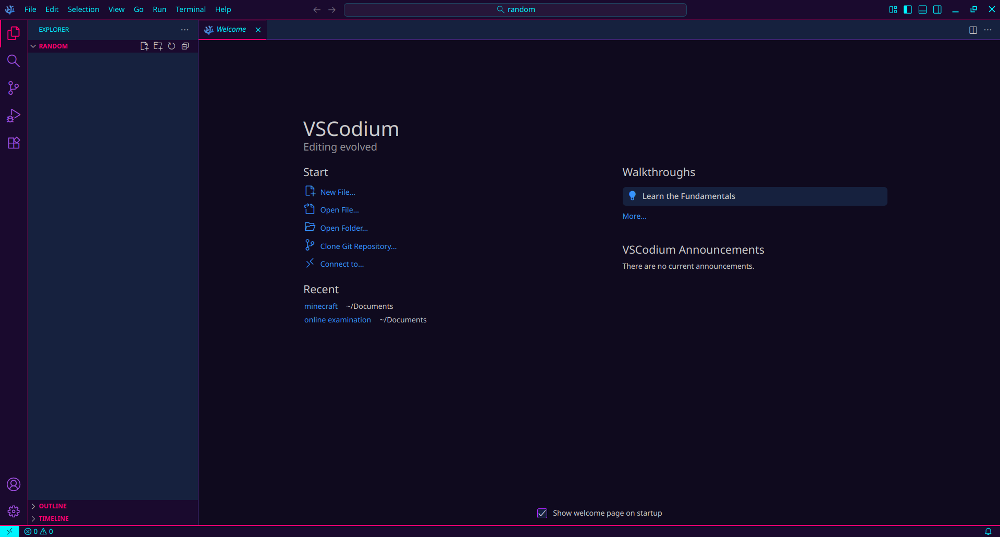
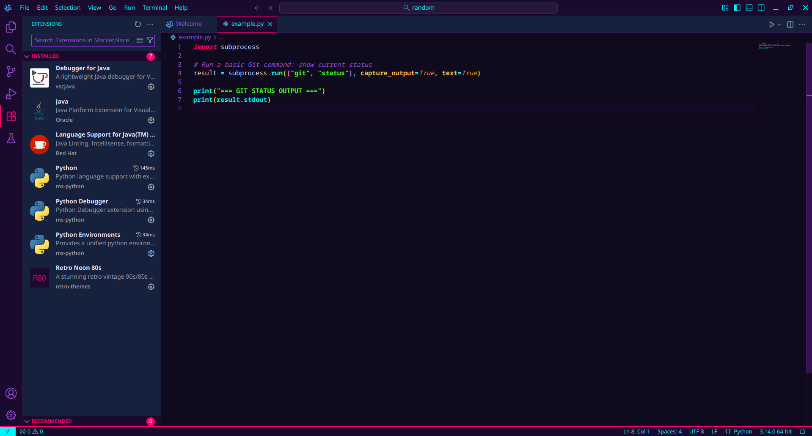
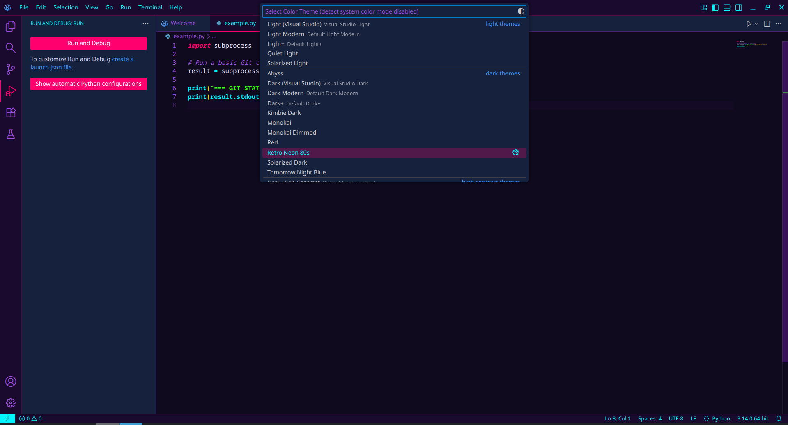
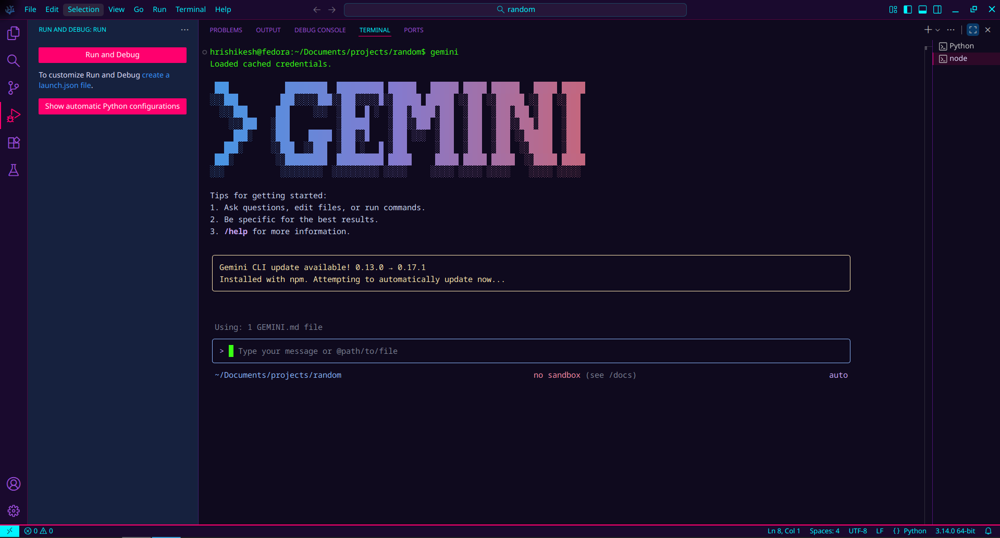

# Retro Neon 80s Theme 🌆✨

<div align="center">


*A stunning retro vintage 90s/80s aesthetic theme with vibrant neon colors and CRT monitor vibes*

[Installation](#-installation) • [Features](#-features) • [Screenshots](#-screenshots) • [Customization](#-customization) • [Contributing](CONTRIBUTING.md)

</div>

---

## 🎨 Features

- **🌈 Vibrant Neon Palette**: Hot pink, cyan, electric purple, and neon green
- **🖥️ CRT Aesthetic**: Deep purple/blue gradients reminiscent of vintage monitors
- **⚡ High Contrast**: Bold, vibrant syntax highlighting for excellent readability
- **🌆 Vapor Wave Vibes**: Inspired by synthwave and vapor wave aesthetics
- **💚 Retro Terminal**: Classic CRT green terminal with modern neon accents
- **✨ Complete Coverage**: Syntax support for all major languages

## 🎯 Color Palette

| Color | Hex | Usage |
|-------|-----|-------|
| 🔥 Hot Pink | `#FF006E` | Keywords, Tags, Errors |
| 💠 Cyan | `#00F5FF` | Functions, Operators, Links |
| 💜 Electric Purple | `#B026FF` | Classes, Attributes, Variables |
| 💚 Neon Green | `#39FF14` | Strings, Terminal, Cursor |
| 🧡 Orange | `#FF9E00` | Numbers, Constants, Warnings |
| 🌙 Muted Purple | `#9D4EDD` | Comments, Inactive Elements |
| 🌌 Deep Purple | `#0f0a1e` | Editor Background |
| 🔵 Navy Blue | `#16213e` | Sidebar, Panels |

## 📦 Installation

### Method 1: Direct Download (Recommended for GitHub users)

1. Download the latest `.vsix` file from the [Releases](../../releases) page
2. Open VS Code
3. Go to **Extensions** (`Ctrl+Shift+X` / `Cmd+Shift+X`)
4. Click the `...` menu at the top → **Install from VSIX...**
5. Select the downloaded `.vsix` file
6. Reload VS Code
7. Activate: **File → Preferences → Color Theme → Retro Neon 80s**

### Method 2: Manual Installation from Source

```bash
# Clone the repository
git clone https://github.com/benevolentshrine/retro-neon-80s-theme.git

# Copy to VS Code extensions directory
# Windows
cp -r retro-neon-80s-theme %USERPROFILE%\.vscode\extensions\

# macOS/Linux
cp -r retro-neon-80s-theme ~/.vscode/extensions/

# Reload VS Code and activate the theme
```

### Method 3: Build from Source

```bash
# Clone the repository
git clone https://github.com/benevolentshrine/retro-neon-80s-theme.git
cd retro-neon-80s-theme

# Install vsce (VS Code Extension Manager) if you don't have it
npm install -g @vscode/vsce

# Package the extension
vsce package

# Install the generated .vsix file
code --install-extension retro-neon-80s-1.0.0.vsix
```

## 🚀 Quick Start

1. Install the theme using one of the methods above
2. Open Command Palette (`Ctrl+Shift+P` / `Cmd+Shift+P`)
3. Type "Color Theme" and select **Preferences: Color Theme**
4. Choose **Retro Neon 80s** from the list
5. Enjoy your retro coding experience! 🎮

## 💻 Language Support

This theme looks amazing with:

<table>
<tr>
<td>

- ✅ JavaScript/TypeScript
- ✅ Python
- ✅ HTML/CSS/SCSS
- ✅ JSON/YAML
- ✅ Markdown
- ✅ React/JSX

</td>
<td>

- ✅ Vue
- ✅ PHP
- ✅ Ruby
- ✅ Go
- ✅ Rust
- ✅ C/C++

</td>
<td>

- ✅ Java
- ✅ C#
- ✅ SQL
- ✅ Shell
- ✅ Docker
- ✅ And many more!

</td>
</tr>
</table>

## 🎨 Screenshots

> **Note**: Add your own screenshots to the `screenshots/` folder to showcase the theme!



*Main Editor View*


*Code Syntax Highlighting*


*Theme Variants*


*Agent View*


## ⚙️ Recommended Settings

For the best retro experience, add these to your VS Code settings:

```json
{
  "editor.fontFamily": "'Fira Code', 'JetBrains Mono', 'Courier New', monospace",
  "editor.fontLigatures": true,
  "editor.fontSize": 14,
  "editor.lineHeight": 22,
  "editor.cursorBlinking": "smooth",
  "editor.cursorSmoothCaretAnimation": "on",
  "editor.bracketPairColorization.enabled": true,
  "workbench.colorTheme": "Retro Neon 80s"
}
```

### 🔤 Recommended Fonts

For maximum retro vibes, try these free fonts:

- [**Fira Code**](https://github.com/tonsky/FiraCode) - Modern coding font with ligatures
- [**JetBrains Mono**](https://www.jetbrains.com/lp/mono/) - Developer-friendly font
- [**Courier Prime Code**](https://quoteunquoteapps.com/courierprime/) - Vintage typewriter feel
- [**VT323**](https://fonts.google.com/specimen/VT323) - True retro terminal font

## 🎭 Theme Variants

Currently available:
- **Retro Neon 80s** (Main dark theme)

*More variants coming soon! (Light theme, different color schemes, etc.)*

## 🛠️ Customization

To customize colors, press `Ctrl+Shift+P` / `Cmd+Shift+P`, type "Open Settings (JSON)", and add:

```json
{
  "workbench.colorCustomizations": {
    "[Retro Neon 80s]": {
      "editor.background": "#yourcolor",
      "terminal.background": "#yourcolor"
    }
  },
  "editor.tokenColorCustomizations": {
    "[Retro Neon 80s]": {
      "comments": "#yourcolor",
      "strings": "#yourcolor"
    }
  }
}
```

## 🤝 Contributing

Contributions are welcome! Please check out our [Contributing Guide](CONTRIBUTING.md) for guidelines.

### How to Contribute

1. 🍴 Fork this repository
2. 🌱 Create a new branch (`git checkout -b feature/amazing-feature`)
3. ✨ Make your changes
4. 💾 Commit your changes (`git commit -m 'Add some amazing feature'`)
5. 📤 Push to the branch (`git push origin feature/amazing-feature`)
6. 🎉 Open a Pull Request

## 📋 Changelog

See [CHANGELOG.md](CHANGELOG.md) for a list of changes.

## 🐛 Found an Issue?

If you find any issues or have suggestions:
1. Check [existing issues](../../issues) first
2. Create a [new issue](../../issues/new) with details
3. Include screenshots if possible

## 📝 License

This project is licensed under the MIT License - see the [LICENSE](LICENSE) file for details.

## 🙏 Credits

Inspired by:
- 80s/90s CRT monitors and vintage computing
- Synthwave and vapor wave aesthetics
- Retro gaming and neon-lit cityscapes
- Classic arcade machines and neon signs

## 💖 Support

If you enjoy this theme:

- ⭐ **Star this repository** - It helps others discover it!
- 🐛 **Report bugs** - Help make it better
- 💬 **Share feedback** - Let us know what you think
- 📢 **Share with friends** - Spread the retro love
- 💰 **Support on Gumroad** - [Get premium support and updates](https://gumroad.com/benevolentshrine)

## 🔗 Links

- [GitHub Repository](https://github.com/benevolentshrine/retro-neon-80s-theme)
- [Report an Issue](../../issues)
- [Request a Feature](../../issues/new)
- [Installation Guide](INSTALL.md)

---

<div align="center">

**Made with 💜 for retro enthusiasts**

*Travel back to the neon-soaked 80s/90s every time you code*

### 🌟 Star us on GitHub — it motivates us a lot!

</div>
